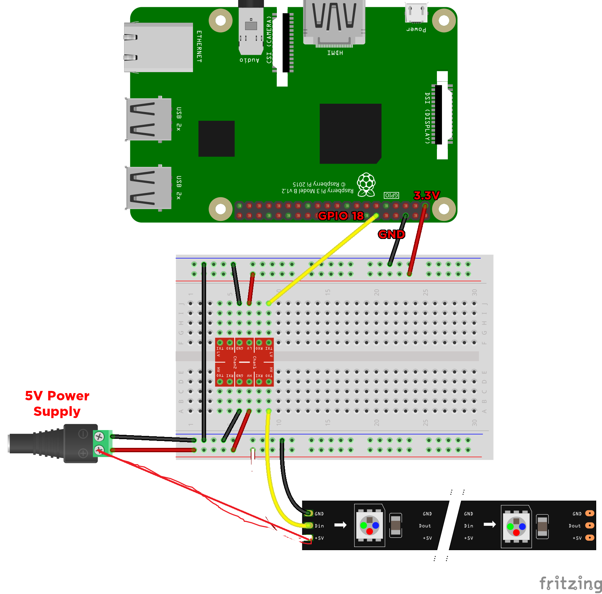
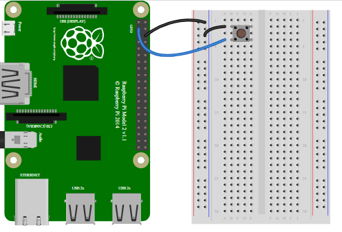

# rpi-monitor-cam-led
 
- *Monitoring playing 2 wav tracks on the local filesystem*
- *As fit to playing track or idle state, showing/flashing LED strip*
- *Monitoring captured photo images from another application and mail image via Gmail service to specified address*

# Components

1) RPi 4B
2) 5V WS2812b led strip 144 led/m
3) SparkFun Logic Level Converter (BiDirectional)
4) 5V/10A DC power


# Installaion dependencies

```
 sudo apt update
 sudo apt-get install inotify-tools unzip -y
 sudo pip3 install pyinotify
 sudo pip3 install rpi_ws281x
 sudo apt-get install scons -y 
 sudo pip3 install adafruit-circuitpython-neopixel
 sudo pip3 install transitions
``` 

# Wiring 






# Additional configuration to enable pulse signal for LED strip on the Pi GPIO

PWM
Since this library and the onboard Raspberry Pi audio both use the PWM, they cannot be used together. You will need to blacklist the Broadcom audio kernel module by creating a file /etc/modprobe.d/snd-blacklist.conf with

blacklist snd_bcm2835
If the audio device is still loading after blacklisting, you may also need to comment it out in the /etc/modules file.

On headless systems you may also need to force audio through hdmi Edit config.txt and add:

hdmi_force_hotplug=1
hdmi_force_edid_audio=1
A reboot is required for this change to take effect

Some distributions use audio by default, even if nothing is being played. If audio is needed, you can use a USB audio device instead.

PCM
When using PCM you cannot use digital audio devices which use I2S since I2S uses the PCM hardware, but you can use analog audio.

SPI
When using SPI the led string is the only device which can be connected to the SPI bus. Both digital (I2S/PCM) and analog (PWM) audio can be used.

Many distributions have a maximum SPI transfer of 4096 bytes. This can be changed in /boot/cmdline.txt by appending

    spidev.bufsiz=32768
On an RPi 3 you have to change the GPU core frequency to 250 MHz, otherwise the SPI clock has the wrong frequency.

Do this by adding the following line to /boot/config.txt and reboot:

    core_freq=250
On an RPi 4 you must set a fixed frequency to avoid the idle CPU scaling changing the SPI frequency and breaking the ws281x timings:

Do this by adding the following lines to /boot/config.txt and reboot:

    core_freq=500
    core_freq_min=500
SPI requires you to be in the gpio group if you wish to control your LEDs without root.

# Change constants for software logic

# Setup systemd service for bootup